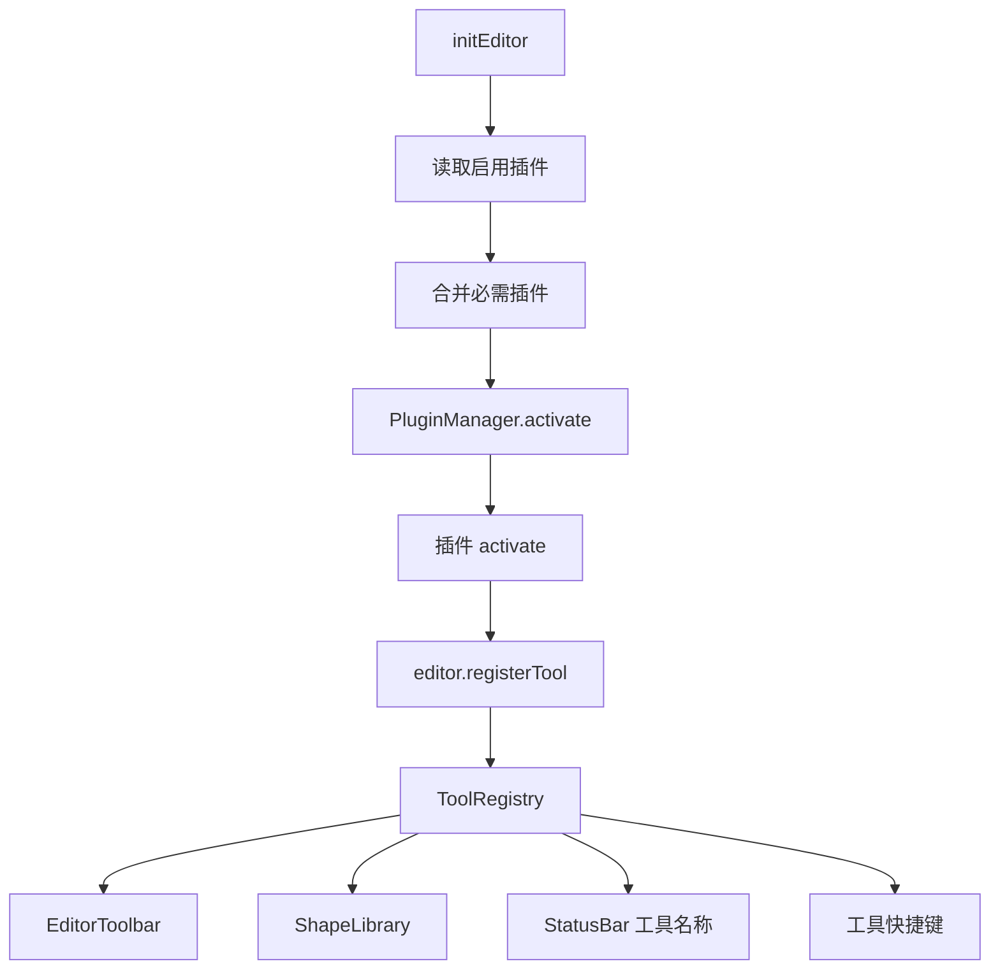
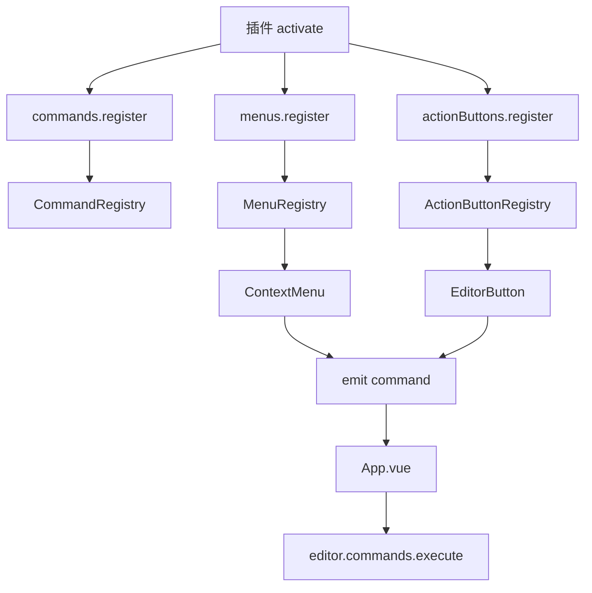

# Leafer Flow 插件化架构

本项目正在从“功能集中在主工程”重构为“核心画布运行时 + 插件宿主 + 插件市场”的结构。

## 核心边界

核心保留：

- Leafer 画布初始化与生命周期
- `Editor` 运行时
- `PluginManager`
- `ToolRegistry`
- `CommandRegistry`
- `MenuRegistry`
- `ActionButtonRegistry`
- history / autosave / serialization 基础服务
- 插件启用状态读取

核心不再直接维护具体业务工具清单。流程图、BPMN、架构图、标尺、吸附、点阵、默认命令、右键菜单和顶部操作按钮都以应用级插件方式接入。

## 插件协议

插件协议定义在：

- `src/editor/api/plugin.ts`
- `src/editor/api/tool.ts`
- `src/editor/api/command.ts`
- `src/editor/api/menu.ts`
- `src/editor/api/action-button.ts`

插件通过 `EditorPluginModule` 暴露：

```ts
export interface EditorPluginModule {
  manifest: EditorPluginManifest;
  contributes?: PluginContributionPreview;
  activate(ctx: PluginContext): void | Promise<void>;
  deactivate?(ctx: PluginContext): void | Promise<void>;
}
```

`EditorPluginManifest.required` 用于标记宿主必需插件。必需插件会始终启用，插件市场中不可关闭。

插件当前可以通过以下入口贡献能力：

```ts
ctx.editor.registerTool(...);
ctx.editor.commands.register(...);
ctx.editor.menus.register(...);
ctx.editor.actionButtons.register(...);
```

插件停用时，`PluginManager` 会按 `pluginId` 清理工具、命令、菜单和 action button 贡献。

## 当前内置插件

内置插件注册表：

- `src/editor/builtin/plugins/index.ts`

当前内置插件：

- `leafer-flow.builtin-core`：必需插件，注册默认命令、右键菜单和顶部操作按钮
- `leafer-flow.canvas-ruler`：画布标尺
- `leafer-flow.canvas-snap`：智能吸附
- `leafer-flow.canvas-dot-matrix`：点阵背景
- `leafer-flow.basic-tools`：基础绘制工具
- `leafer-flow.flow-shapes`：流程图节点
- `leafer-flow.bpmn-shapes`：BPMN 节点
- `leafer-flow.architecture-shapes`：架构图节点

## 插件市场状态

插件市场数据入口：

- `src/editor/plugins/market/builtin-registry.ts`
- `src/editor/plugins/market/plugin-market-service.ts`

当前支持：

- 读取默认启用插件
- 读取并强制合并必需插件
- 从 `localStorage` 读取启用插件列表
- 保存启用插件列表
- 列出内置插件市场条目
- 通过插件 id 查找内置插件
- 启用/禁用非必需内置插件
- 统计工具、命令、菜单、按钮贡献数量与标签
- 通过 `contributes` 展示未启用插件的贡献预览

当前存储 key：

```txt
leafer-flow.enabled-plugins
```

## 工具注册流



## 命令与 UI 分发流



## UI 注册表驱动

以下 UI 已从 registry 派生数据：

- `src/components/ShapeLibrary.vue`
  - 来自 `editor.toolRegistry.getShapeLibraryGroups()`
  - 已移除静态图形库 fallback
  - 搜索使用 `label`、`tool`、`keywords`
- `src/components/EditorToolbar.vue`
  - 来自 `editor.toolRegistry.getToolbarGroups()`
  - 已移除静态 toolbar fallback
  - 支持任意插件贡献分组
- `src/components/ContextMenu.vue`
  - 来自 `editor.menus.getContextMenuGroups()`
- `src/components/EditorButton.vue`
  - 来自 `editor.actionButtons.list()`
- `src/components/StatusBar.vue`
  - 工具名称由 `App.vue` 从 `editor.toolRegistry.list()` 派生后传入
- `src/editor/shortcuts.ts`
  - 工具快捷键由 `App.vue` 从 `editor.toolRegistry.listToolbarTools()` 派生

## 已完成的旧架构清理

- 旧 `editor.tools` Map 已移除。
- 旧 `Editor.register(name, tool)` 已移除。
- 旧 `ToolRegistry.registerLegacy(...)` 已移除。
- `src/editor/index.ts` 不再维护工具清单。
- `src/editor/index.ts` 不再直接注册默认 commands / menus / action buttons。
- 图形库不再依赖静态 `shapeLibraryGroups` fallback。
- 工具栏不再硬编码 `flow`、`bpmn`、`architecture`、`shapes` 分组布局。
- 状态栏不再硬编码工具名称表。
- 工具快捷键不再硬编码具体工具 id。
- 图形库搜索别名已合并到工具贡献 `keywords`。

## 仍未插件化的区域

- `EditorPanel.vue` 属性面板仍是静态宿主 UI，且组件较重。
- `EditorButton.vue` 的“绘制设置”面板仍直接调用 drawing settings getter/setter。
- `ViewControls.vue` 仍是静态宿主 UI，虽然已经通过 command id 分发。
- 文件导入导出、模板等能力当前已 command/action 化，但还没有按功能域拆成可单独禁用的插件。
- 远程插件加载暂未实现；当前市场模型先服务本地内置插件。

## 后续演进方向

1. 属性面板 contribution / settings panel contribution。
2. 将文件、导出、模板等功能域拆成独立内置插件。
3. 为插件配置增加 schema 或 Vue component 入口。
4. 抽象插件源，支持 builtin / remote / local-dev。
5. 在远程插件启用前设计权限、沙箱、签名和安全边界。
