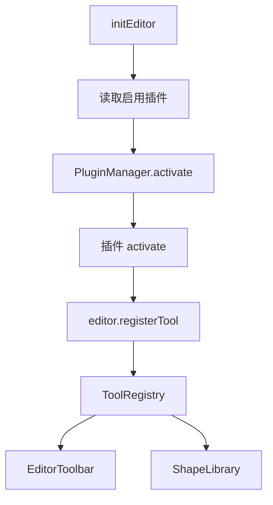

# Leafer Flow 插件化架构

本项目正在从“功能集中在主工程”重构为“核心画布运行时 + 插件宿主 + 插件市场”的结构。

## 核心边界

核心保留：

- Leafer 画布初始化与生命周期
- `Editor` 运行时
- `PluginManager`
- `ToolRegistry`
- history / autosave / serialization 基础服务
- 插件启用状态读取

核心不再直接维护具体业务工具清单。流程图、BPMN、架构图、标尺、吸附、点阵等都以应用级插件方式接入。

## 插件协议

插件协议定义在：

- `src/editor/api/plugin.ts`
- `src/editor/api/tool.ts`

插件通过 `EditorPluginModule` 暴露：

```ts
export interface EditorPluginModule {
  manifest: EditorPluginManifest;
  activate(ctx: PluginContext): void | Promise<void>;
  deactivate?(ctx: PluginContext): void | Promise<void>;
}
```

插件通过 `ctx.editor.registerTool(...)` 注册工具贡献。

## 当前内置插件

内置插件注册表：

- `src/editor/builtin/plugins/index.ts`

当前内置插件：

- `leafer-flow.canvas-ruler`：画布标尺
- `leafer-flow.canvas-snap`：智能吸附
- `leafer-flow.canvas-dot-matrix`：点阵背景
- `leafer-flow.basic-tools`：基础绘制工具
- `leafer-flow.flow-shapes`：流程图节点
- `leafer-flow.bpmn-shapes`：BPMN 节点
- `leafer-flow.architecture-shapes`：架构图节点

## 插件市场状态

插件市场数据入口：

- `src/editor/plugins/market/builtin-registry.ts`

当前支持：

- 读取默认启用插件
- 从 `localStorage` 读取启用插件列表
- 保存启用插件列表
- 列出内置插件市场条目
- 通过插件 id 查找内置插件

当前存储 key：

```txt
leafer-flow.enabled-plugins
```

## 工具注册流



## UI 注册表驱动

以下 UI 已开始从 `ToolRegistry` 派生数据：

- `src/components/ShapeLibrary.vue`
- `src/components/EditorToolbar.vue`

`App.vue` 初始化后读取：

- `editor.toolRegistry.getShapeLibraryGroups()`
- `editor.toolRegistry.getToolbarGroups()`

## 后续重构顺序

建议继续按以下顺序推进：

1. 新增插件市场 UI，支持内置插件启用/禁用。
2. 将 command/action 改为 `CommandRegistry`。
3. 将右键菜单改为插件注册驱动。
4. 将属性面板 section 改为插件注册驱动。
5. 将快捷键改为插件注册驱动。
6. 将文件导入导出、模板等功能拆为内置插件。
7. 等协议稳定后，再考虑远程插件加载与权限模型。

## 注意事项

- 当前仍保留旧的 `editor.tools` Map 用于兼容既有绘制执行流程。
- `ToolRegistry` 是未来工具单一来源。
- 图形库 item 的 `tool` 已放宽为 `string`，为市场插件工具 id 做准备。
- 远程插件加载暂未实现；当前市场模型先服务本地内置插件。
