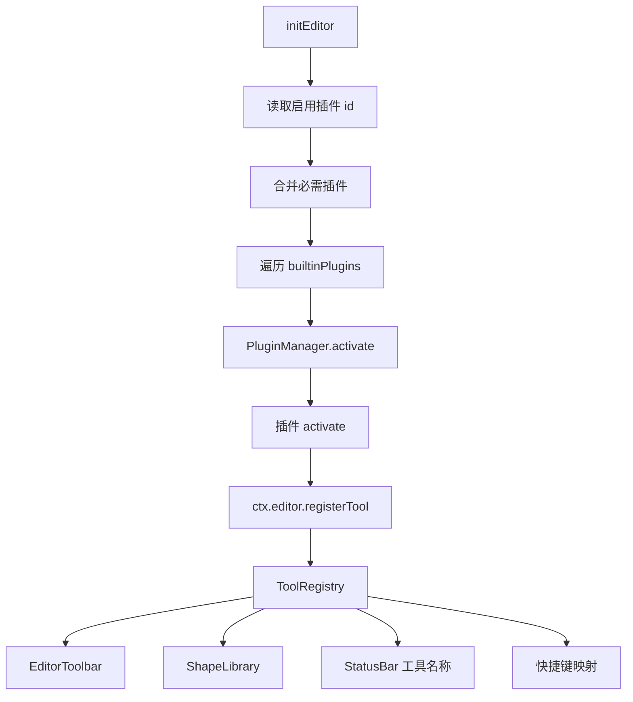
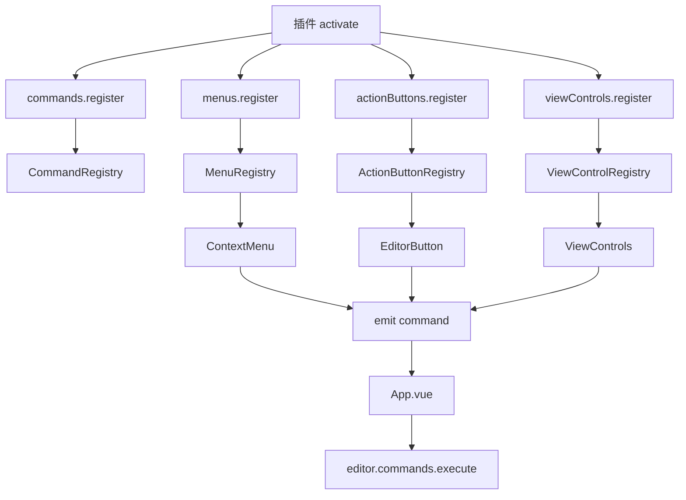
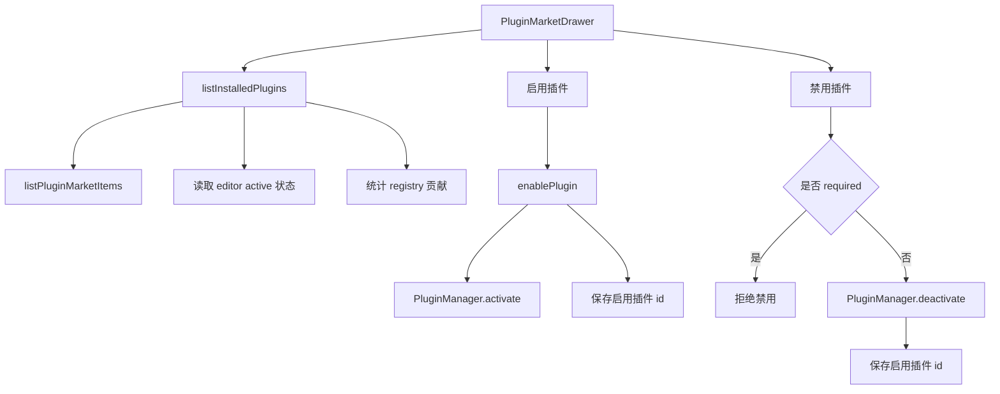

# Leafer Flow 当前架构

本文记录当前实现事实，作为后续开发和文档维护的唯一架构参考。

## 总体结构

当前编辑器采用：

> 核心画布运行时 + 插件宿主 + 注册表驱动 UI + 插件市场

核心运行时负责 Leafer app 生命周期、编辑器状态、注册表、history、autosave 和连接线标签同步。具体工具、节点、菜单、命令和顶部按钮主要通过内置插件贡献到宿主。

## 核心入口

- `src/editor/index.ts`
  - `initEditor(view)` 创建 `Editor`。
  - 读取启用插件 id。
  - 激活必需插件和已启用的内置插件。
- `src/editor/editor.ts`
  - 创建 Leafer `App`。
  - 持有 `PluginManager`、`ToolRegistry`、`CommandRegistry`、`MenuRegistry`、`ActionButtonRegistry`、`ViewControlRegistry`。
  - 管理工具执行、绘制光标、history/autosave 初始化。
  - 提供 `commitMutation()` 统一提交 history、autosave 和连接线标签同步等 mutation side effects。
  - 在移动、缩放、旋转结束后通过 `commitMutation({ syncConnectorLabels: true, autoSave: false })` 同步连接线标签并保存历史。
- `src/editor/builtin/plugins/index.ts`
  - 内置插件清单。
- `src/editor/plugins/market/builtin-registry.ts`
  - 内置插件市场数据和启用状态存储。

## 核心保留能力

核心层保留：

- Leafer 画布初始化与生命周期。
- `Editor` 运行时。
- `PluginManager`。
- `ToolRegistry`。
- `CommandRegistry`。
- `MenuRegistry`。
- `ActionButtonRegistry`。
- `ViewControlRegistry`。
- history / autosave 基础服务。
- serialization / connector label 等编辑器内部数据机制。
- 插件启用状态读取与内置插件激活。

核心不再维护静态工具清单，也不再在 `src/editor/index.ts` 中逐项注册工具、命令、菜单或按钮。

## 插件协议

协议文件：

- `src/editor/api/plugin.ts`
- `src/editor/api/tool.ts`
- `src/editor/api/command.ts`
- `src/editor/api/menu.ts`
- `src/editor/api/action-button.ts`
- `src/editor/api/view-control.ts`

插件模块结构：

```ts
export interface EditorPluginModule {
  manifest: EditorPluginManifest;
  contributes?: PluginContributionPreview;
  activate(ctx: PluginContext): void | Promise<void>;
  deactivate?(ctx: PluginContext): void | Promise<void>;
}
```

插件上下文提供：

- `pluginId`
- `editor`
- `logger`
- `storage`

插件 storage 使用独立 localStorage 命名空间：

```txt
leafer-flow.plugin.${pluginId}.
```

`manifest.required` 表示必需插件。必需插件始终启用，插件市场中不能关闭。

## 当前内置插件

内置插件注册表：`src/editor/builtin/plugins/index.ts`

当前插件：

- `leafer-flow.builtin-core`
  - 必需插件。
  - 注册默认命令、右键菜单、顶部操作按钮。
- `leafer-flow.canvas-ruler`
  - 画布标尺。
- `leafer-flow.canvas-snap`
  - 智能吸附。
- `leafer-flow.canvas-dot-matrix`
  - 点阵背景。
- `leafer-flow.drawing-settings`
  - 绘制设置面板。
  - 提供连线样式、自由绘制平滑度和吸附开关。
- `leafer-flow.view-controls`
  - 视图控件。
  - 提供缩放、适应内容和居中内容命令及底部视图控件。
- `leafer-flow.file-actions`
  - 文件操作。
  - 提供保存和打开流程文件能力。
- `leafer-flow.export-actions`
  - 导出操作。
  - 提供 PNG 和 SVG 导出能力。
- `leafer-flow.template-actions`
  - 模板操作。
  - 提供业务流程、BPMN、系统架构和泳道协作等模板插入能力。
- `leafer-flow.basic-tools`
  - 基础绘制工具。
- `leafer-flow.flow-shapes`
  - 流程图节点。
- `leafer-flow.bpmn-shapes`
  - BPMN 节点。
- `leafer-flow.architecture-shapes`
  - 架构图节点。

## 工具注册流程



工具贡献由 `ToolContribution` 描述，包含：

- `id`
- `label`
- `pluginId`
- `createTool`
- `library`
- `toolbar`

图形库、工具栏、状态栏工具名称和工具快捷键都从 `ToolRegistry` 派生，不再维护静态 fallback。

## 命令与 UI 分发流程



当前通用编辑动作优先通过 `CommandRegistry` 执行。UI 组件尽量只收集用户意图并 emit command id，不直接调用底层 `do-*` action。

## Registry 驱动的 UI

已由 registry 派生的 UI：

- `src/components/ShapeLibrary.vue`
  - 使用 `editor.toolRegistry.getShapeLibraryGroups()`。
  - 搜索使用 `label`、`tool`、`keywords`。
- `src/components/EditorToolbar.vue`
  - 使用 `editor.toolRegistry.getToolbarGroups()`。
- `src/components/ContextMenu.vue`
  - 使用 `editor.menus.getContextMenuGroups()`。
- `src/components/EditorButton.vue`
  - 使用 `editor.actionButtons.list()` 的分组。
  - 普通按钮、下拉菜单和绘制设置面板都由 `ActionButtonGroupContribution` 派生。
- `src/components/ViewControls.vue`
  - 使用 `editor.viewControls.list()` 的贡献。
  - 视图控件按钮和命令由 `leafer-flow.view-controls` 插件贡献。
- `src/components/StatusBar.vue`
  - 工具名称由 `App.vue` 从 `editor.toolRegistry.list()` 派生后传入。
- `src/editor/shortcuts.ts`
  - 工具快捷键由 toolbar contribution 派生。

## Action Button 面板贡献

`ActionButtonGroupContribution.kind` 支持：

- `button`：渲染为一组直接执行 command 的按钮。
- `dropdown`：渲染为 command 下拉菜单。
- `panel`：渲染为设置面板。

`panel` 通过 `panelItems` 描述可编辑设置项。目前支持：

- `select`：用于字符串或布尔选项。
- `range`：用于数字滑块。

绘制设置已迁移为独立内置插件 `leafer-flow.drawing-settings` 的 `drawing-settings` panel contribution。`EditorButton.vue` 不再直接导入 drawing settings getter/setter，而是只根据 registry contribution 渲染通用控件。禁用该插件会通过 `PluginManager.deactivate()` 清理对应 action button contribution，并隐藏绘制设置面板。

## 插件停用清理

`PluginManager.deactivate(pluginId)` 会：

1. 调用插件自身的 `deactivate(ctx)`。
2. 按 `pluginId` 清理工具贡献。
3. 按 `pluginId` 清理命令贡献。
4. 按 `pluginId` 清理菜单贡献。
5. 按 `pluginId` 清理 action button 贡献。
6. 按 `pluginId` 清理 view control 贡献。
7. 从 active plugin map 中移除插件。

Canvas overlay 类插件必须自己在 `deactivate(ctx)` 中释放第三方运行时资源。目前：

- `canvas-ruler` 调用 `Ruler.dispose()`。
- `canvas-snap` 调用 `Snap.destroy()`。
- `canvas-dot-matrix` 调用 `DotMatrix.destroy()`。

## 插件市场流程



市场存储 key：

```txt
leafer-flow.enabled-plugins
leafer-flow.enabled-plugins.default-migrations
```

`leafer-flow.enabled-plugins.default-migrations` 用于将新增的默认启用内置插件迁移到已有用户配置中。目前用于确保 `leafer-flow.drawing-settings`、`leafer-flow.view-controls`、`leafer-flow.file-actions`、`leafer-flow.export-actions`、`leafer-flow.template-actions` 在旧启用列表存在时也默认启用。

市场当前只服务内置插件源。远程插件、本地开发插件源、权限、沙箱、签名等仍未实现。

## Mutation 提交与序列化契约

`Editor.commitMutation(options)` 是当前 mutation side effects 的统一入口：

- 默认保存 history 并立即触发 autosave。
- `syncConnectorLabels: true` 时会先捕获选中连接线标签偏移并同步连接线标签位置。
- `autoSave: false` 可用于已有自动保存监听覆盖的高频或低风险变更。

主要 action、属性面板 composable、工具执行完成和 autosave restore 已改为通过 `commitMutation()` 提交，避免在各处重复散落 `history.save()` / `autoSave.save()` / `syncConnectorLabels()`。

序列化入口：`src/editor/core/flow-serialization.ts`。

当前导出的文件包含：

```json
{
  "schema": "leafer-flow",
  "version": 1,
  "children": []
}
```

`deserializeTreeWithConnectors()` 会校验 schema / version，并兼容旧文件中缺失 schema / version 的情况。连接线状态、节点 id remap、连接线标签 remap 仍在该模块集中处理。

## 高风险链路

以下模块影响连接线、序列化、剪贴板、编组、文件、history/autosave，修改时需要重点验证：

- `src/editor/tools/draw-arrow.ts`
- `src/editor/core/flow-serialization.ts`
- `src/editor/core/connector-labels.ts`
- `src/editor/action/do-clipboard.ts`
- `src/editor/action/do-group.ts`
- `src/editor/action/do-ungroup.ts`
- `src/editor/action/do-file.ts`

## 仍未插件化或仍需收敛的区域

- `EditorPanel.vue` 属性面板 UI 仍由宿主组件承载；状态解析与属性写入已抽到 `src/composables/useEditorPanelState.ts`，后续如需完全插件化，可继续引入 property panel contribution。
- 远程插件、本地开发插件源、权限、沙箱、签名等仍未实现。
- serialization round-trip 自动化测试尚未建立。

已完成收敛：

- `EditorButton.vue` 的绘制设置面板已改为 action button `panel` contribution，宿主组件不再直接调用 drawing settings getter/setter。
- 绘制设置面板已从 `builtin-core` 拆为独立内置插件 `leafer-flow.drawing-settings`，可在插件市场单独启用或禁用。
- `ViewControls.vue` 已改为 `ViewControlRegistry` 驱动，并由 `leafer-flow.view-controls` 插件贡献命令和控件。
- 文件、导出、模板能力已从 `builtin-core` 拆为 `leafer-flow.file-actions`、`leafer-flow.export-actions`、`leafer-flow.template-actions`。
- mutation side effects 已收敛到 `Editor.commitMutation()`。
- serialization schema 与版本号已建立，当前版本为 `leafer-flow` / `1`。
