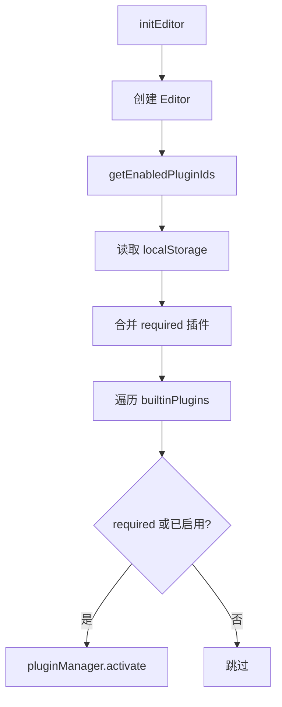
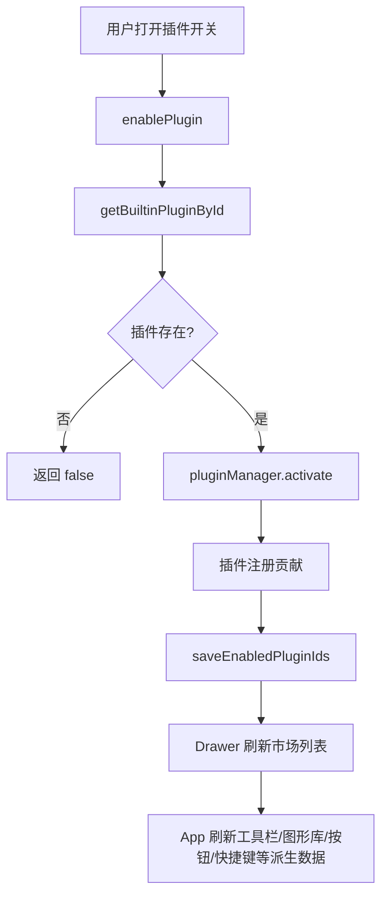
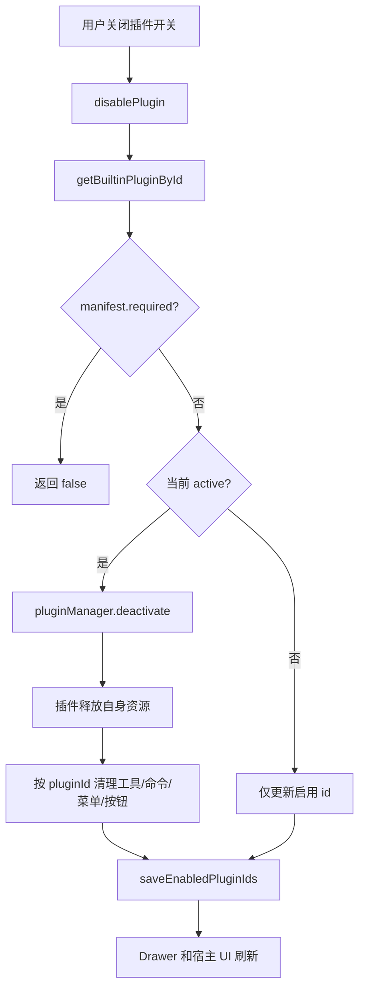

# 插件市场与插件启停流程

本文记录当前插件市场实现和后续演进约束。

## 当前形态

插件市场当前是编辑器内右侧 Drawer，不引入新路由。

原因：

- 保留画布编辑上下文，不打断当前工作流。
- 当前市场只有内置插件源，不需要完整页面级信息架构。
- 启停插件后需要即时刷新 registry 驱动的 UI。
- 避免过早引入跨页面编辑器生命周期管理。

## 模块结构

```txt
src/editor/plugins/market/
  builtin-registry.ts
  plugin-market-service.ts

src/components/PluginMarket/
  PluginMarketDrawer.vue
```

## 数据与服务边界

### `builtin-registry.ts`

负责内置插件源和启用状态：

- `getEnabledPluginIds()`
  - 从 `localStorage` 读取启用插件 id。
  - 自动合并 required 插件。
  - 无存储值时返回 required + enabledByDefault 插件。
- `saveEnabledPluginIds(ids)`
  - 保存启用插件 id。
  - 强制保留 required 插件。
- `listPluginMarketItems()`
  - 从 `builtinPlugins` 生成市场条目。
- `getBuiltinPluginById(pluginId)`
  - 按 id 查找内置插件模块。

当前存储 key：

```txt
leafer-flow.enabled-plugins
```

### `plugin-market-service.ts`

负责市场业务流程，避免 Vue 组件直接操作 localStorage 或内置插件表：

- `listInstalledPlugins(editor?)`
- `enablePlugin(editor, pluginId)`
- `disablePlugin(editor, pluginId)`

`listInstalledPlugins()` 会组合：

- 插件 manifest。
- 是否内置。
- 是否启用。
- 是否 active。
- 工具、命令、菜单、按钮贡献摘要。

贡献摘要优先读取当前 active registry：

- `editor.toolRegistry.listByPlugin(pluginId)`
- `editor.commands.listByPlugin(pluginId)`
- `editor.menus.listByPlugin(pluginId)`
- `editor.actionButtons.listByPlugin(pluginId)`

如果插件未启用，则回退到 `plugin.contributes` 展示预览标签。

### `PluginMarketDrawer.vue`

负责市场 UI：

- 展示插件列表。
- 搜索插件名称、id、描述、分类和 capabilities。
- 展示启用状态、active 状态、内置标记、必需标记、版本、分类、能力。
- 展示工具、命令、菜单、按钮贡献数量。
- 展示工具、命令、菜单、按钮标签预览。
- 支持启用/禁用非必需插件。
- 禁用必需插件开关。

## 初始化流程



## 启用流程



## 禁用流程



## 当前可即时启停的贡献

- 工具插件。
- 图形插件。
- 命令插件。
- 菜单插件。
- action button 插件。
- 已实现释放逻辑的 canvas overlay 插件。

即时启停依赖：

- `ToolRegistry.unregisterByPlugin(pluginId)`。
- `CommandRegistry.unregisterByPlugin(pluginId)`。
- `MenuRegistry.unregisterByPlugin(pluginId)`。
- `ActionButtonRegistry.unregisterByPlugin(pluginId)`。
- `PluginManager.deactivate(pluginId)` 的统一清理。

Canvas overlay 插件还必须实现自身释放逻辑。当前已覆盖：

- `Ruler.dispose()`。
- `Snap.destroy()`。
- `DotMatrix.destroy()`。

## 必需插件策略

当前必需插件：

```txt
leafer-flow.builtin-core
```

必需插件规则：

- `getEnabledPluginIds()` 始终合并 required 插件。
- `saveEnabledPluginIds()` 始终保留 required 插件。
- `initEditor()` 无条件激活 required 插件。
- `disablePlugin()` 拒绝禁用 required 插件。
- 市场 UI 展示必需标记，并禁用开关。

`builtin-core` 当前负责默认命令、右键菜单和顶部操作按钮。若后续拆分文件、导出、模板等功能域插件，需要重新评估哪些能力仍必须保留在 required 插件中。

## 宿主刷新要求

插件启停后，宿主需要刷新所有由 registry 派生的数据：

- 工具栏分组。
- 图形库分组。
- 状态栏工具名称映射。
- 工具快捷键映射。
- 顶部 action button 分组。
- 右键菜单分组。

如果当前选中工具来自刚禁用的工具插件，应切回 `select`。

## 后续演进

### 插件配置

为插件协议增加配置入口，例如：

```ts
configure?(ctx: PluginContext): PluginConfigSchema | VueComponent
```

可优先承接当前仍在宿主 UI 中的绘制设置面板。

### 插件源抽象

拆分市场数据源：

```txt
src/editor/plugins/market/sources/
  builtin-source.ts
  remote-source.ts
  local-dev-source.ts
```

支持：

- 内置插件。
- 远程插件索引。
- 本地开发插件。

### 页面级市场

当出现以下需求时，再升级到新路由或独立页面：

- 插件数量明显增多。
- 需要插件详情页。
- 需要远程安装、更新、卸载。
- 需要评分、版本历史、依赖关系。
- 需要开发者发布入口。

### 远程插件安全边界

远程插件启用前必须明确：

- 权限模型。
- 沙箱边界。
- 签名与来源校验。
- 插件代码加载方式。
- 网络、文件、localStorage 访问限制。
- 插件异常隔离和卸载恢复策略。
