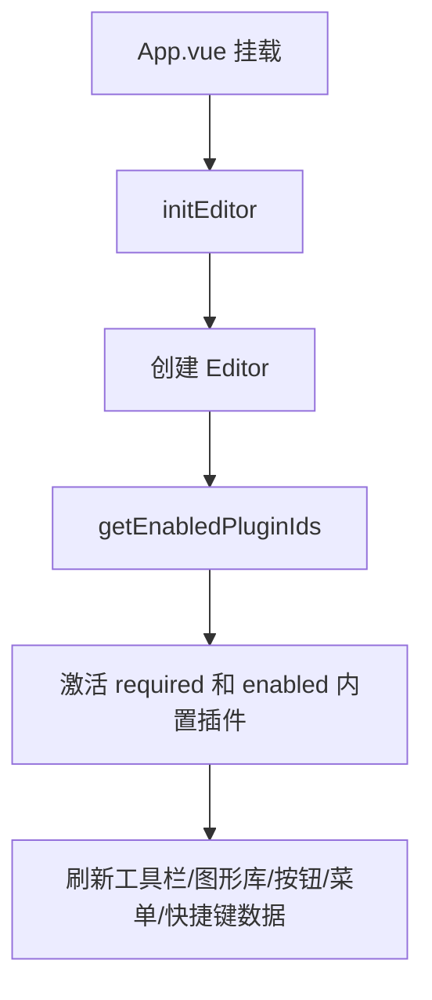
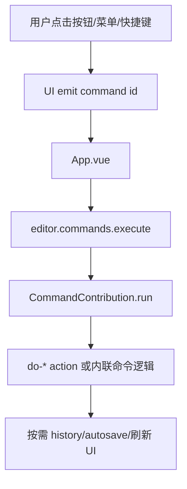
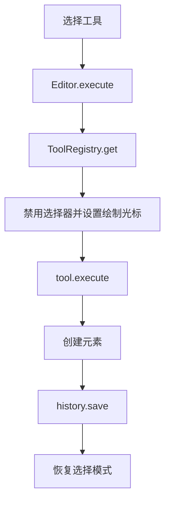

# Leafer Flow 项目状态

## 项目概述

`leafer-flow` 是一个基于 Vue 3、Vite、TypeScript 和 LeaferJS 的流程图/图形编辑器练手项目。

当前架构：

> 核心画布运行时 + 插件宿主 + 注册表驱动 UI + 插件市场

## 当前功能实现情况

### 编辑器核心

- ✅ Leafer 画布初始化与生命周期。
- ✅ `Editor` 运行时。
- ✅ history 基础服务。
- ✅ autosave 基础服务。
- ✅ 序列化 / 自动恢复基础链路。
- ✅ serialization schema 与版本号。
- ✅ 保存文件结构与自动恢复结构通过 `documentType` 区分。
- ✅ 连接线标签运行时同步与持久化辅助。
- ✅ 插件宿主与插件协议。

### 注册表

- ✅ `PluginManager`：插件激活 / 停用。
- ✅ `ToolRegistry`：工具贡献注册表。
- ✅ `CommandRegistry`：命令贡献注册表。
- ✅ `MenuRegistry`：菜单贡献注册表。
- ✅ `ActionButtonRegistry`：顶部操作按钮贡献注册表。

### 插件市场

- ✅ 右侧 Drawer 市场入口。
- ✅ 内置插件列表。
- ✅ 启用/禁用非必需插件。
- ✅ 必需插件保护。
- ✅ active / enabled 状态展示。
- ✅ 工具、命令、菜单、按钮贡献数量。
- ✅ 未启用插件贡献标签预览。
- ❌ 远程插件源。
- ❌ 本地开发插件源。
- ❌ 插件配置入口。
- ❌ 插件详情页。

### 内置插件

- ✅ `leafer-flow.builtin-core`
  - 默认命令。
  - 右键菜单。
  - 顶部操作按钮。
  - 必需插件，不可关闭。
- ✅ `leafer-flow.basic-tools`
  - 基础绘制工具。
- ✅ `leafer-flow.flow-shapes`
  - 流程图节点。
- ✅ `leafer-flow.bpmn-shapes`
  - BPMN 节点。
- ✅ `leafer-flow.architecture-shapes`
  - 架构图节点。
- ✅ `leafer-flow.canvas-ruler`
  - 画布标尺，可停用并释放运行时资源。
- ✅ `leafer-flow.canvas-snap`
  - 智能吸附，可停用并释放运行时资源。
- ✅ `leafer-flow.canvas-dot-matrix`
  - 点阵背景，可停用并释放运行时资源。

### 绘制工具与图形

- ✅ 基础图形
  - 矩形。
  - 圆形 / 椭圆。
  - 菱形。
  - 三角形。
  - 五边形。
  - 六边形。
  - 箭头 / 连接线。
  - 文本。
  - 自由绘制。
- ✅ 流程图节点
  - 开始/结束。
  - 处理。
  - 判断。
  - 输入/输出。
  - 文档。
  - 数据库。
  - 子流程。
  - 连接点。
  - 泳道。
  - 延迟。
  - 准备。
  - 手动输入。
  - 手动操作。
  - 存储数据。
  - 显示。
  - 页外连接。
  - 合并。
  - 注释。
- ✅ BPMN 节点
  - 开始事件。
  - 中间事件。
  - 结束事件。
  - 排他网关。
  - 并行网关。
  - 包容网关。
  - 任务。
  - 数据对象。
  - 数据存储。
- ✅ 架构图节点
  - Actor。
  - Use Case。
  - Component。
  - Package。
  - Node。
  - Queue。
  - Cache。
  - Cloud。
  - Service。
  - Device。

### UI 组件

- ✅ `App.vue`：编辑器初始化、command 分发、插件市场协调、运行时 UI 数据刷新。
- ✅ `EditorToolbar.vue`：从 `ToolRegistry` 派生工具栏。
- ✅ `ShapeLibrary.vue`：从 `ToolRegistry` 派生图形库。
- ✅ `EditorButton.vue`：从 `ActionButtonRegistry` 派生按钮/下拉菜单。
- ✅ `ContextMenu.vue`：从 `MenuRegistry` 派生右键菜单。
- ✅ `LayerPanel.vue`：图层展示和图层操作。
- ✅ `EditorPanel.vue`：属性面板。
- ✅ `StatusBar.vue`：状态栏。
- ✅ `ViewControls.vue`：视图控制。
- ✅ `EditorLog.vue`：操作日志。
- ✅ `PluginMarketDrawer.vue`：插件市场 Drawer。
- ✅ `Icon.vue`：图标组件。

### 编辑功能

- ✅ 工具切换。
- ✅ 快捷键支持。
- ✅ 多选 / 框选。
- ✅ 复制 / 粘贴。
- ✅ 删除。
- ✅ 全选。
- ✅ 撤销 / 重做。
- ✅ 清空画布。
- ✅ 元素对齐。
- ✅ 元素分布。
- ✅ 元素编组 / 取消编组。
- ✅ 元素锁定 / 解锁。
- ✅ 元素显隐切换。
- ✅ 图层前移 / 后移 / 置顶 / 置底。
- ✅ 图层拖拽排序。
- ✅ 连接线置顶。
- ✅ 连接线标签。
- ✅ 属性面板基础编辑。
- ✅ 日志系统。
- ✅ 元素计数显示。
- ✅ 缩放 / 适配视图 / 居中 / 重置缩放。

### 文件与模板

- ✅ 保存。
- ✅ 加载。
- ✅ 自动保存恢复。
- ✅ 导出 PNG。
- ✅ 导出 SVG。
- ✅ 业务流程模板。
- ✅ 专业图模板。
- ❌ 导出 PDF。
- ❌ 导入 Visio / Draw.io 等外部格式。

## 当前实现流程

### 编辑器启动

### 用户命令执行

### 工具绘制

## 当前仍需推进

### 高优先级

- [ ] 收敛 history / autosave / connector label sync 等 mutation side effects。
- [x] 建立 serialization schema 与版本号。
- [x] 明确保存文件结构与自动恢复结构的边界。
- [ ] 为 connector label / custom data / group 建立 round-trip 验收。
- [ ] 为 clipboard / group / ungroup / file 建立最小自动化测试。

### 插件化深化

- [ ] 属性面板 contribution 化。
- [ ] 绘制设置面板 contribution 化或 settings schema 化。
- [ ] 文件 / 导出 / 模板能力从 `builtin-core` 拆为独立插件。
- [ ] 插件配置入口。
- [ ] 插件源抽象：builtin / remote / local-dev。
- [ ] 远程插件加载、权限、沙箱、签名和安全边界。

### 组件结构优化

- [ ] 拆分 `EditorPanel.vue` 中的 selection/property 逻辑。
- [ ] 抽出 `useSelectionInspector` 或类似 composable。
- [ ] 复用 selection predicates：`canGroup`、`canUnGroup`、`hasConnectorSelection`。
- [ ] 继续拆分 `App.vue` 中的运行时刷新、shape drop、框选、插件市场协调逻辑。

### 高级能力

- [ ] 导出 PDF。
- [ ] 导入其他格式，如 Visio、Draw.io。
- [ ] 自动布局算法。
- [ ] 缩略图导航。
- [ ] 多层画布。
- [ ] 多人协作编辑。
- [ ] 评论功能。
- [ ] 版本控制。

### 质量与验证

- [ ] 完善 TypeScript 类型定义，尤其是 Leafer / Connector 类型兼容区域。
- [ ] 添加 action/core 层自动化测试。
- [ ] 建立高风险链路验收清单并在改动后执行。
- [ ] 优化大量图形时的性能表现。

## 当前设计原则

- UI 优先从 registry 派生数据。
- Vue 组件优先 emit command id，不直接调用底层 action。
- 工具插件通过 `ctx.editor.registerTool(...)` 注册贡献。
- 可禁用插件必须在 `deactivate(ctx)` 后清理运行时副作用。
- 市场服务负责插件启停业务边界，Vue 组件不直接操作内置插件数组。
- 高风险链路包括连接线、序列化、剪贴板、编组、文件、history/autosave。
